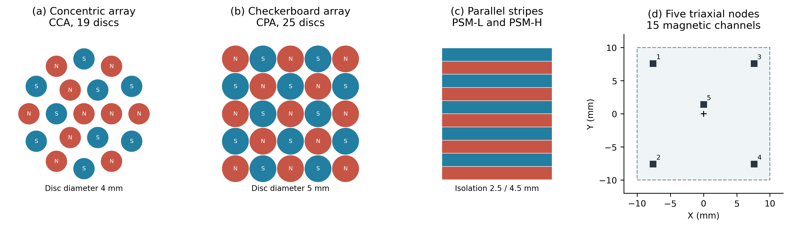
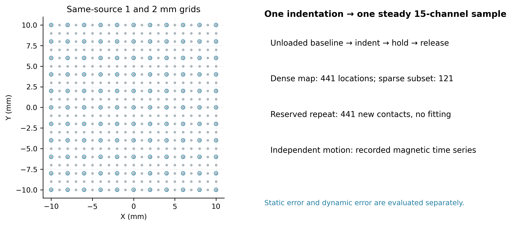
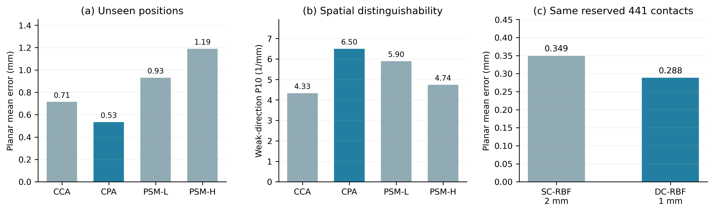
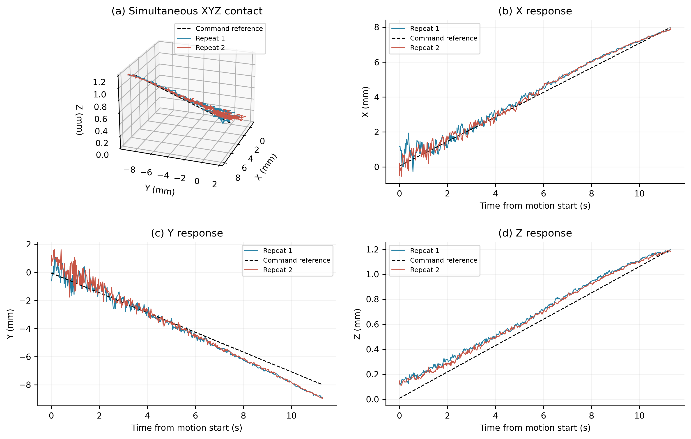
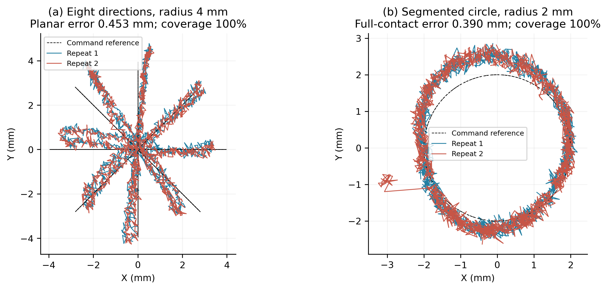

# Magnetic spatial encoding and command-referenced three-dimensional contact trajectory reconstruction with a five-node soft magnetic tactile interface

Liming Qian^a,\*, Jiaqi Li^b, Feng Guo^a

^a Department of Mechanical Engineering, Nantong Institute of Technology, Nantong, Jiangsu Province, China 
^b [Affiliation of Jiaqi Li to be confirmed] 
\* Corresponding author: Liming Qian, e-mail 20160031@ntit.edu.cn, ORCID 0009-0004-6958-2384

## Abstract

Soft magnetic tactile interfaces need spatially distinguishable responses to localize contact from few readout nodes. We compared concentric-ring (CCA), checkerboard (CPA) and parallel-stripe (PSM; two silicone thicknesses) configurations using five triaxial magnetometers over a 20 × 20 mm area. In a grouped spatial holdout (36 fitting positions and 85 unseen positions), the CPA configuration produced the lowest mean planar error (0.534 mm versus 0.714–1.189 mm). A shape-normalized radial-basis-function (RBF) decoder calibrated on a 1-mm grid gave a mean planar error of 0.288 mm and X/Y/Z mean absolute errors of 0.163/0.206/0.031 mm on 441 contacts from an independent repeat record at previously calibrated coordinates and a commanded indentation of 0.4 mm. This planar error was 17.5% lower than that of a same-source 2-mm calibration. After documented magnetic-layer replacement and reassembly followed by five-point planar registration, a representative repeated XYZ action gave a command-referenced mean three-dimensional error of 0.569 mm with 99.91% output coverage. The motion reference was the programmed and time-interpolated platform trajectory, not independent external position metrology. These results support configuration-level comparison, dense calibration and bounded command-referenced trajectory reconstruction with a compliant magnetic tactile interface.

Keywords: tactile sensor; magnetic sensor; localization; calibration; trajectory reconstruction; soft magnetic interface

## 1 Introduction

Soft tactile sensing can provide the location and movement of contact while allowing a compliant interface to accommodate the contacting object. Magnetic sensing separates the deformable magnetic layer from the readout electronics. This arrangement is attractive for small robotic contact surfaces, but accurate localization depends on how deformation changes the field across the available sensing channels. A large response does not necessarily imply a distinctive response: different positions or indentation depths may produce similar magnetic measurements.

The physical design of magnetic tactile sensors has therefore received substantial attention. Wang et al. [5] formulated a design methodology relating the magnetic source, field gradient, compliant structure and calibration of a triaxial sensor. Hellebrekers et al. [7] demonstrated continuous position and force estimation from soft magnetic skin using neural networks. Their magnetic silicone specimen yielded X, Y and Z mean absolute errors of 1.15, 1.16 and 0.25 mm over a 40 × 40 mm area. Yan et al. [8] used a periodically magnetized film for force decoupling and high-resolution contact localization, reporting axis-wise position errors of approximately 0.09 and 0.11 mm over an 18 × 18 mm region. Hu et al. [9] combined magnetic maps, Kriging and nearest-neighbour matching over 220 × 220 mm, reporting an average localization error of about 1.2 mm. These studies establish that a limited number of magnetic sensing elements can encode contact positions much more finely than their physical spacing.

ReSkin [10] and AnySkin [11] further address replaceable interfaces and variation between sensor instances. Their results motivate explicit consideration of mounting conditions and calibration reuse. However, material compliance also introduces a distinction between a steady indentation map and a continuously moving contact. A mapping that accurately reconstructs repeated static contacts may encounter shear, relaxation and history-dependent responses during sliding. Static localization and motion tracking consequently require separate experimental evidence.

Prior magnetic tactile studies commonly use commanded robot or motion-stage coordinates as contact-location labels. ReSkin used specified Dobot Magician XY positions [10], Hu et al. used an electrically driven XYZ platform [9], and Yang et al. used an XY motion platform [19]; their published experimental protocols did not report a separate external instrument for verifying the commanded XY position. Following this convention, we evaluate trajectories against the programmed and time-interpolated platform motion and report command-referenced reconstruction errors rather than independently metrologized absolute positioning accuracy.

We evaluate how magnetic spatial encoding and calibration density support contact tracking with five readout nodes using a shape-normalized RBF decoder. Our contributions are: (i) a common-readout, grouped spatial-holdout comparison of three layouts in four tested structural configurations, with a field-based diagnostic of the normalized response; (ii) a same-source 121- versus 441-position calibration comparison on one reserved repeat record; and (iii) radial, circular and simultaneous XYZ motion demonstrations after documented magnetic-layer reassembly and planar registration. The main static result is produced by one frozen 441-node DC-RBF and the single reserved Trial 154 test record; it is not assembled from different models. The RBF-labelled analyses share the same core mapping implementation, while their training datasets and frozen parameter instances differ, and the causal analysis adds a separately identified history-residual branch. All positions are referenced to commanded Cartesian-platform coordinates.

## 2 Sensor and experimental protocol

### 2.1 Magnetic layouts and readout geometry

The sensor uses five MLX90393 triaxial magnetic nodes, giving 15 magnetic channels. Relative to the centre of the four outer nodes, their planar coordinates are (−7.594, +7.594), (−7.594, −7.594), (+7.594, +7.594), (+7.594, −7.594) and (0, +1.406) mm. The composite specimen footprint is 46 × 56 mm; experiments evaluate a central 20 × 20 mm region. The compliant material was C0005, a two-part platinum-cured silicone (supplier data: Shore C 5, A:B = 1:1, 30 min working time and 2–4 h cure at 25 °C; tensile strength 1.20 MPa, tear strength 6.30 N mm−1 and elongation 900%). CPA discs had a supplier-reported surface field of 1800 G (0.18 T); the magnet grade was not specified. These are supplier specifications, not measured specimen properties or a reconstructed cure history.

The concentric alternating-polarity array (CCA) comprises 19 discs, each nominally 4 mm in diameter and 1 mm thick, arranged as a centre disc and rings of six and twelve discs at radii of 5 and 10 mm. The checkerboard alternating-polarity array (CPA) comprises 25 discs of nominal diameter 5 mm and thickness 1 mm, with 5 mm centre spacing. The parallel-stripe magnetized sheet (PSM) has ten alternating stripes and a nominal thickness of 1 mm. PSM-L and PSM-H denote nominal silicone isolation thicknesses of 2.5 and 4.5 mm, respectively. These dimensions describe isolation layers, not independently measured distances to the Hall-sensitive elements. CCA and CPA use the nominal 4.5 mm isolation configuration. Figure 1 shows the layouts and readout positions; photographs and an assembly drawing accompany the supplementary material.

Figure 1. Magnetic layouts and common five-node readout. Red and blue indicate nominal reference-face polarity, not field strength. Disc positions are nominal; the stripe drawing is schematic and does not specify a measured pole pitch. The dashed square marks the 20 × 20 mm evaluation region.

A brass conical indenter contacts the silicone directly. Its measured contact-end diameter is 1 mm and its confirmed outer diameter is 4 mm. The mounting thread is M6 × 1. The dimensioned source drawing specifies a total length of 13 mm, an 8 mm tip-to-thread-start distance and a 6 mm hexagonal width. The indenter axis defines the contact position; its contact patch can increase during indentation. No force is inferred from indentation without a separate force calibration.

The 67 successfully decoded per-device register snapshots for the released records specify GAIN = 5, HALLCONF = 12, RES X/Y/Z = 0, DIG FILT = 0, OSR/OSR2 = 0 and temperature compensation disabled; the acquisition logs record a 400 kHz I2C clock. A further 23 device readback entries contain diagnostic status errors and are retained without interpreting them as register values. The decoded snapshots take precedence over a legacy profile comment that mentioned gain 7. The requested magnetic period was 20 ms, whereas timestamps gave effective grouped rates of 37.82–38.59 frames s−1 for the 17 reported Session III records and 65.63 frames s−1 for static Trial 154. Across 111 unloaded 0.35-s windows in those Session III records, the median per-channel standard deviation was 6.62 μT (95th percentile 12.23 μT) and the median absolute early-to-late window shift was 3.48 μT (95th percentile 11.74 μT). Trial 154 gave corresponding medians of 6.66 and 3.75 μT over 441 windows. These short-window statistics do not quantify temperature drift, creep or long-term stability.

The indenter was driven by a JGAURORA A5S desktop Cartesian 3D-printer stage under host software that sent absolute-coordinate commands and logged time-stamped commands and events. Dynamic references were reconstructed from the command log and recorded timing. Consequently, the reported dynamic error is command-referenced trajectory reconstruction error: it includes platform tracking, controller timing, compliance and contact-patch effects and is not an independently metrologized absolute positioning error. Platform repeatability and backlash were not measured separately.

### 2.2 Coordinates and contact sampling

A motorized printer stage supplies controlled contact motion. With mounting centre (Xc, Yc), reference contact height Zc and stage coordinates (Xp, Yp, Zp), we define:

$$\mathbf{q}=(x,y,z)^T=(X_p-X_c,\ Y_p-Y_c,\ Z_c-Z_p)^T.\qquad (1)$$

Positive z denotes indentation. Static labels use the commanded indentation recorded in the contact events and the initialized contact reference. A 2 mm grid contains 121 locations and a 1 mm grid contains 441 locations. These are calibration locations, not physical sensor counts. At each location, the indenter approaches without contact, establishes a local unloaded baseline, indents, holds and retracts. One physical contact produces one 15-channel steady sample. Continuous magnetic streams and motion events are retained separately.

The per-channel median between 180 and 20 ms before indentation defines the baseline B0. The median in the corresponding final 180–20 ms interval of the hold defines the loaded sample. Contacts without adequate valid baseline or hold data are not converted into calibration samples. Grouping samples by physical contact prevents adjacent frames from a single hold from being treated as independent repetitions. Figure 2 summarizes the protocol.

Figure 2. Dense calibration, source grouping and independent evaluation. The same 1 mm acquisition supplies the 2 mm subset and the dense map. Entire physical contacts or records are separated for evaluation; only five triaxial nodes are used throughout.

### 2.3 Evaluation datasets

An audit of 398 trial metadata files from 18–20 September identified ten transitions among CPA, CCA, PSM-L and PSM-H; the operator record confirms that the relevant layer changes involved physical removal and reassembly. CPA reappeared at Trial 148 and at S20260919 Trials 013, 054 and 113, with Trials 054 and 113 explicitly labelled `five_point_reassembly`. Trials 26–39 of S20260920 share one saved registration after the final CPA restoration; that shared transform defines a record group and does not imply that the entire study contained only one physical reassembly. The records do not constitute repeated, identical-protocol remount cycles and therefore do not estimate a cross-remount performance distribution.

For the configuration comparison, each specimen has 121 locations, three indentation depths of 0.2, 0.5 and 0.8 mm and two repetitions, giving 726 contacts per configuration. Thirty-six 4 mm-spaced locations support fitting and parameter selection; all repetitions and depths at the other 85 locations remain outside fitting, giving 510 unseen-position test contacts per configuration. Full-grid deployment models are fitted only after this spatial evaluation.

For the CPA density comparison, a common pool contains 1322 valid contacts at depths of 0.3, 0.4 and 0.6 mm. One contact lacks a usable baseline. A separate complete 441-location record at 0.4 mm is reserved for evaluation. The test locations can coincide with calibration nodes, but the physical contacts are different and the whole record is excluded from fitting. Frozen model files and contact identifiers permit this separation to be checked. The sparse model uses the 2 mm subset of that same training pool; the dense model uses all available 1 mm locations. Historical deployment models and their additional training contacts are documented separately and are not substituted for these frozen models.

Dynamic results are reported only for the records used in the figures, tables and stated claims. Development, aborted and unpublished trials are not treated as one prospectively defined evaluation cohort. Eight compound-action records (Trials 26, 28, 30, 31, 32, 34, 35 and 36) are representative command-referenced trajectory demonstrations; they were not preregistered as an exhaustive all-direction benchmark and are not used to estimate an all-direction success rate.

Position references are reconstructed from recorded stage commands, action timestamps and estimated segment durations. They therefore measure agreement with the commanded motion reference, not independently measured contact-patch kinematics. Repetition evaluates the response to the same controlled external action. Reported trajectories retain the recorded coordinate calibration and are not realigned after observing test errors. Supplementary Table S2 defines the records behind each result.

## 3 Magnetic response maps and decoding

### 3.1 Normalized spatial mapping

Concatenating the five triaxial readings gives B. We separate the baseline-corrected response into amplitude A and a unit response vector u:

$$\Delta\mathbf{B}=\mathbf{B}-\mathbf{B}_0,\quad A=\Vert\Delta\mathbf{B}\Vert_2,\quad\mathbf{u}=\frac{\Delta\mathbf{B}}{\max(A,\varepsilon)}.\qquad (2)$$

Amplitude is measured in microtesla; u is dimensionless. Normalization reduces changes caused by a common amplitude scale while retaining the relative response across channels. It does not assume exact separation of depth and position. Each calibrated location supplies a normalized response centre cj. For the frozen density experiment, unit vectors are averaged within a location and the resulting mean is normalized again.

We use regularized Gaussian radial basis function regression. With M centres and their planar coordinates arranged in P, the model is:

$$K_{ij}=\exp(-\gamma\Vert\mathbf{c}_i-\mathbf{c}_j\Vert_2^2),\quad\mathbf{W}_{xy}=(\mathbf{K}+\lambda_{xy}\mathbf{I})^{-1}\mathbf{P}.\qquad (3)$$

$$\widehat{\mathbf{p}}(\mathbf{u})=\sum_{j=1}^{M}\exp(-\gamma\Vert\mathbf{u}-\mathbf{c}_j\Vert_2^2)\mathbf{w}_j.\qquad (4)$$

The prediction is continuous and is not snapped to a calibration node. We call the 2 mm subset model SC-RBF and the dense 1 mm model DC-RBF. These abbreviations describe calibration strategies, not different regression families or magnetic structures. SC-RBF and DC-RBF use the same shape-normalized Gaussian-RBF mapping code and differ in calibration density, training contacts and frozen parameter values. The 0.288 mm headline result uses only the frozen 441-node DC-RBF with Trial 154.

### 3.2 Shape-dependent indentation estimation

The indentation branch uses amplitude together with spatial response shape. For the dense model, L is the natural logarithm of amplitude clipped below at 10 to the power −6 microtesla, and the 32-dimensional feature vector is:

$$\boldsymbol{\phi}=[\mathbf{u}^T,L,L^2,(L\mathbf{u})^T]^T.\qquad (5)$$

Features are standardized using training means and standard deviations. A constant is appended as the last column of T. Ridge regression gives:

$$\boldsymbol{\beta}=(\mathbf{T}^T\mathbf{T}+\lambda_z\mathbf{D})^{-1}\mathbf{T}^T\mathbf{z},\quad\widehat{z}=\mathbf{t}(\boldsymbol{\phi})^T\boldsymbol{\beta}.\qquad (6)$$

D penalizes the feature coefficients but not the intercept. The interaction terms allow the amplitude-to-depth relation to vary with response shape. The sparse frozen model uses the raw 15-channel response with L and L squared instead. Full feature definitions, coefficients and normalization statistics are included with the executable models.

| Model | Centres | XY gamma | XY penalty | Z feature | Z penalty |
|---|---:|---:|---:|---|---:|
| Frozen SC-RBF | 121 | 2 | 0.001 | Raw response and log amplitude | 0.1 |
| Frozen DC-RBF | 441 | 4 | 0.001 | Unit response and log interaction | 0.001 |
| Working-domain WD-RBF | 441 | 8 | 0.001 | Unit response and log interaction | 0.001 |

Table 1. Parameters of the frozen density comparison and working-domain deployment model. The latter uses 0.4 and 0.6 mm training depths and is evaluated on separate motion records. It is not used to claim independence on the reserved static record.

A discrete prototype localizer (DPL) is retained for applications where the desired output is a calibrated node. It selects the node with the largest cosine similarity to any of its stored templates. A local linear amplitude-to-depth relation supplies indentation. Its mean planar error is evaluated on the same reserved contacts, but its historical training pool is different; it is a distinct output-task benchmark, not a controlled density ablation.

### 3.3 Working domain and mounting registration

The working-domain model WD-RBF is a frozen parameter instance of the same core RBF framework and targets 0.4–0.6 mm indentation using the two corresponding dense calibration levels. Its deployed response-amplitude threshold is 291.732 microtesla and its cosine-similarity threshold is 0.985322. The pooled DC-RBF is another frozen instance fitted to a different calibration pool. Because response sensitivity varies spatially, an amplitude threshold is not a universal geometrical depth threshold. These bookkeeping distinctions do not imply that the paper compares regression families or claims that RBF is superior to neural networks.

After mounting, five known planar contact positions, comprising the centre and four surrounding directions, support rigid registration. Steady-hold median predictions pi are matched to commanded positions qi. The fitted proper rotation R and translation t minimize their summed squared planar discrepancies, subject to orthonormal R and determinant +1. This registration corrects global translation and rotation without changing z. Holding samples, rather than transient entry or release tails, define each calibration point. The transform is fixed before the evaluated motion. Raw-response fingerprint registration is not used as a validated component of the results reported here.

During operation, the magnetic stream is decoded causally and rejected samples remain invalid. Release terminates a trajectory segment; it does not connect the path to the coordinate origin. Display smoothing and edge suppression are distinct from the recorded predictions used for quantitative analysis.

### 3.4 Causal working-domain decoder

An additional working-domain decoder, WD-Causal, is evaluated for radial and circular movement. Its base XY mapping uses standardized shape–amplitude features and its base Z mapping uses the raw magnetic difference. Gaussian kernel ridge regression supplies the initial coordinate q0. XY training includes the 0.2 mm level as auxiliary spatial data; Z training targets the 0.5 and 0.8 mm levels. This decoder has a different source pool from the 0.4–0.6 mm dense working-domain model.

A 34-dimensional feature vt concatenates the current response divided by the training amplitude median, the unit response, log(1 + A), and q0. Past observations at delays of 0.10, 0.25 and 0.50 s form the causal history:

$$\mathbf{h}_t=[\mathbf{v}_t,\mathbf{v}_t-\mathbf{v}_{t-0.10},\mathbf{v}_t-\mathbf{v}_{t-0.25},\mathbf{v}_t-\mathbf{v}_{t-0.50}].\qquad (7)$$

$$\widehat{\mathbf{q}}_t=\widehat{\mathbf{q}}_t^0+g_t\mathbf{W}_h^T[1;\widetilde{\mathbf{h}}_t].\qquad (8)$$

The 136 history features are standardized, and ridge regression with penalty 0.01 learns a residual from nine earlier motion records. The gate g is activated by short-delay normalized magnetic change and decays with a 1.2 s time constant. Gaps exceeding 250 ms reset the history. All lagged observations precede or coincide with their requested historical times. The evaluated radial and circular records are not used for this fitting. Supplementary material gives the gate rule and complete coefficients. These tests establish performance of the complete decoder; they do not isolate the causal contribution through a paired base-versus-history ablation on the new trajectories.

### 3.5 Error and spatial distinguishability

Planar and three-dimensional errors are mean Euclidean distances to the reference; axis-wise errors are mean absolute errors. Output coverage is the fraction of eligible motion samples with valid predictions. Error and coverage are reported together. A 50 ms start guard is used for ordinary motion segments. Circular paths use 128 short linear segments with host-side waiting; their approximately 49 ms short movements cannot use that guard. Circular movement-only and complete-contact intervals are therefore evaluated separately.

To study spatial encoding, finite differences on the 2 mm response map estimate the planar Jacobian Ju. Repetition differences divided by the square root of two estimate a response covariance S. With 10% isotropic shrinkage, we compute:

$$\boldsymbol{\Sigma}=0.9\mathbf{S}+0.1\frac{\mathrm{tr}(\mathbf{S})}{15}\mathbf{I},\quad\mathbf{G}=\mathbf{J}_u^T\boldsymbol{\Sigma}^{-1}\mathbf{J}_u.\qquad (9)$$

The square root of the smaller eigenvalue of G measures the weaker spatial direction relative to repeated-contact variability. The covariance includes mechanical and contact variation; it is not purely electronic noise. These quantities provide empirical explanations within the measured configurations rather than a universal magnetic-field optimum.

## 4 Results

### 4.1 Configuration comparison

The CPA configuration achieves the lowest mean position and indentation errors on the matched unseen-position test (Table 2). Each row contains 510 contacts, with all depths and repetitions at a test location withheld together.

| Configuration | Planar mean error mm | Planar P95 mm | Z MAE mm |
|---|---:|---:|---:|
| CCA | 0.714 | 1.611 | 0.0634 |
| CPA | 0.534 | 1.505 | 0.0575 |
| PSM-L | 0.930 | 2.124 | 0.0897 |
| PSM-H | 1.189 | 2.994 | 0.0864 |

Table 2. Spatial holdout performance using 36 fitting locations and 85 unseen locations per configuration.

CPA does not have the largest median whitened gradient. It instead combines the highest tenth-percentile weak-direction gradient, 6.50 per mm, with the lowest median local condition number, 1.57, and the highest median cross-depth shape cosine, 0.99966. The corresponding weak-direction tenth percentiles are 4.33, 5.90 and 4.74 per mm for CCA, PSM-L and PSM-H. These results suggest that limiting weakly distinguishable regions matters more than maximizing mean response alone. For the stripe configurations, median amplitude–indentation slopes decrease from approximately 1040 to 520 microtesla per mm as nominal isolation increases from 2.5 to 4.5 mm. Figure 3 summarizes the accuracy and weak-direction comparison. Geometry, dimensions and assembly all contribute to these configuration differences.

Figure 3. Configuration-level spatial holdout errors and weak-direction sensitivity, followed by the CPA calibration-density comparison on the same 441 reserved contacts. The discrete-node benchmark has a different output task and source pool and is reported separately in the text.

### 4.2 Dense static localization

On the complete reserved repeat record, DC-RBF yields a mean planar error of 0.288 mm, planar RMSE of 0.380 mm and planar P95 of 0.790 mm. X, Y and Z MAEs are 0.163, 0.206 and 0.0315 mm. SC-RBF yields a planar mean error of 0.349 mm and Z MAE of 0.0337 mm. Dense calibration therefore reduces the planar mean error by 17.5%. All 441 contacts are included for both models.

For calibrated-node output, DPL identifies 412 of the 441 nodes correctly, or 93.42%, and gives a mean planar node error of 0.0731 mm. This error describes selecting known nodes; it is not a claim of 0.0731 mm continuous spatial resolution. The continuous and discrete results serve different application requirements.

Table 3 places the static results beside corresponding static literature metrics. The continuous errors here are numerically lower than the larger-area magnetic silicone result [7], while the axis-wise position errors remain above those reported by Yan et al. [8]. The comparison shows submillimetre continuous localization with five sensing nodes, without equating different specimen areas, training protocols or indentation ranges. A force error is not converted into an indentation error.

| Study and task | Area mm × mm | Static position result mm | Static indentation result mm | Position reference / separate external position metrology |
|---|---|---|---|---|
| Hellebrekers et al. [7], silicone XYZ regression | 40 × 40 | X/Y MAE 1.15 / 1.16 | Z MAE 0.25 | Automated loading coordinates / not reported in checked protocol |
| Yan et al. [8], dense localization | 18 × 18 | Fivefold X/Y MAE 0.09 / 0.11 | Depth calibration present; no matched Z MAE used here | Programmed indentation grid / not reported in checked protocol |
| Hu et al. [9], large-area localization | 220 × 220 | Mean localization error about 1.2 | Force metrics not converted to displacement | Electric XYZ stage; digital force gauge for force / position metrology not reported |
| This work, reserved-repeat continuous regression | 20 × 20 | X/Y MAE 0.163 / 0.206; planar 0.288 | Z MAE 0.0315 | Printer commands and time interpolation / not performed |

Table 3. Static-to-static comparison. The published quantities retain their task and metric definitions. The final column states the position reference reported in the checked experimental method and whether separate external position metrology was reported. The reserved-repeat result in this work is not an unseen-position test; the separate spatial holdout is given in Table 2.

Yan et al. acquired 40,500 samples at 0.2 mm spatial spacing and five indentation depths using nine triaxial taxels [8]. Our density experiment uses 1322 training contacts at 1 mm spacing with five nodes, followed by 441 reserved contacts. Thus the comparison also involves different calibration budgets and sampling strategies, rather than only a difference between reported errors.

### 4.3 Independent cross and simultaneous XYZ motion

At a commanded depth of 0.6 mm and a cross-scan extent of 6 mm, WD-RBF achieves a planar mean error of 0.510 mm, P95 of 0.964 mm, Z MAE of 0.0789 mm and coverage of 97.44%. The corresponding SC-RBF record gives 0.855 mm planar error and 0.0498 mm Z MAE. The working-domain configuration improves planar tracking in this condition with an approximately 0.029 mm increase in depth error. Each configuration has one complete record here, so this is a deployment comparison rather than a repeated paired algorithm study.

Simultaneous XYZ movement provides a stronger test than constant-depth sliding. For a commanded increment of (+8, −8, +1.2) mm, two executions yield three-dimensional mean errors of 0.564 and 0.574 mm. Their combined result is 0.569 mm, with planar error of 0.561 mm, Z MAE of 0.0725 mm and 1091 valid predictions from 1092 eligible samples. The Z-reference correlations are 0.99830 and 0.99847. At common command progress, the mean between-repeat differences are 0.365 mm in XY and 0.0131 mm in Z. Figure 4 presents both executions without retrospective spatial realignment.

Figure 4. Independently recorded XYZ contact movement and axis-wise time series for two executions. Dashed curves are command-derived stage references. Solid curves are recorded valid predictions after the previously established mounting registration. Time is relative to the start of each execution.

Eight compound-action records (Trials 26, 28, 30, 31, 32, 34, 35 and 36) are reported as representative command-referenced trajectory demonstrations using the saved pooled DC-RBF, gate and registration. Across these actions, output coverage ranges from 98.74% to 100%, and mean three-dimensional error ranges from 0.569 to 0.796 mm (median 0.710 mm). These ranges describe only the reported actions in the tested workspace. The records were not preregistered as a prospectively defined all-direction benchmark and are not used to estimate an all-direction success rate or unknown-trajectory generalization. Repeating the same eight actions would strengthen action repeatability evidence but would not remove action-set selection effects; a confirmatory benchmark would require a new independently specified action set and unconditional reporting of that new set.

### 4.4 Radial and circular contact trajectories

WD-Causal gives a planar error of 0.453 mm and Z MAE of 0.0556 mm during an eight-direction outward-and-return scan of radius 4 mm, with full coverage. The two executions give planar errors of 0.466 and 0.440 mm, and their mean planar prediction difference at common progress is 0.174 mm. This experiment tests direction changes across the same contact region.

For a segmented circle of radius 2 mm, movement-only planar error is 0.407 mm and Z MAE is 0.0485 mm, with full coverage. Including inter-segment holds gives a planar error of 0.390 mm. The two movement-only repetitions give 0.381 and 0.434 mm. At radius 4 mm, movement-only and full-contact planar errors are 0.772 and 0.752 mm, respectively, also with full coverage. The greater error at the larger radius identifies a useful operating-range distinction without changing the response model after observing the test.

Figure 5. Eight-direction radial movement and a segmented circular path decoded by WD-Causal. Blue and red show two executions; dashed black shows the command-derived reference. Missing output intervals are not bridged. The circle panel includes inter-segment holds, corresponding to 0.390 mm planar error; the movement-only value is 0.407 mm.

Each circle comprises 128 linear segments. Although the nominal segment speed is 2 mm/s, host-side waiting lowers the complete-path average speeds to approximately 0.322 and 0.556 mm/s for radii of 2 and 4 mm. These experiments demonstrate repeated circular contact tracking under the recorded timing, not constant-speed circular motion at 2 mm/s. Their absolute errors are calculated relative to the original command centre, not a circle fitted to the predicted trajectory.

## 5 Discussion

The configuration study indicates that stable spatial response structure is a useful design criterion for soft magnetic localization. The derivative of a normalized magnetic response makes the relevant trade-off explicit:

$$\frac{\partial\mathbf{u}}{\partial q_k}=\frac{\mathbf{I}-\mathbf{u}\mathbf{u}^T}{A}\frac{\partial\Delta\mathbf{B}}{\partial q_k}.\qquad (10)$$

Normalization removes changes parallel to the current response direction, but the division by amplitude can amplify perturbations at weak contact. A suitable operating domain must therefore accompany normalized decoding. The empirical result for CPA is consistent with its stronger low-percentile spatial distinguishability and cross-depth stability. It does not imply that a checkerboard is universally optimal across different magnet sizes, elastomers or sensing geometries.

High-density calibration improves repeated-contact localization without increasing the number of electronic nodes. The 17.5% planar improvement compares a common source acquisition and an identical reserved test record. This directly separates the calibration-density benefit from remounting or session changes. For tasks requiring stable categorical contact regions, node classification is also useful, but its 0.073 mm node error should remain distinct from continuous-coordinate accuracy.

The independent motion experiments show that static magnetic maps contain information about simultaneous planar movement and indentation. A planar error of 0.288 mm at a held contact and a three-dimensional error of 0.569 mm on a moving XYZ path describe different operating conditions. The gap can include viscoelastic response, shear, mounting and command-reference timing. Multiple magnetic-layer switches and physical reassemblies occurred between dense calibration and later CPA tests. After the final CPA restoration and five-point registration, the eight reported representative XYZ actions yielded 0.569–0.796 mm command-referenced three-dimensional errors and 98.74–100% coverage. Their common saved registration defines an evaluation group; it does not imply that only one physical reassembly occurred.

Repetition under the same controlled external action is valuable evidence of response consistency. It does not require an additional displacement instrument during normal sensor use. The present command-derived reference and repeatability measurements are appropriate to the reported reconstruction task and follow the position-reference convention used in the checked magnetic tactile studies. Additional metrology would be useful specifically to separate stage tracking, changing contact-patch geometry and deformation errors; it is not presented as a universal publication prerequisite. Likewise, repeated frames within a trajectory are not independent specimen replicates. The current study evaluates the measured configurations and selected operating conditions, not manufacturing variability across a population of sensors.

The RBF branches share a core mapping framework but use different calibration pools and frozen parameter instances, and incompatible tasks are not pooled. The present contribution is a sensor-configuration and calibration study, not a new-regression-algorithm competition. Achieving the stated results with a shape-normalized RBF decoder establishes feasibility without a deep neural network; it neither claims that neural networks fail nor that RBF is superior, so an additional deep-learning benchmark is not logically required by the stated claim.

## 6 Conclusions

A five-node soft magnetic tactile interface supports submillimetre static contact localization and command-referenced three-dimensional trajectory reconstruction through spatial response mapping. Among four tested structural configurations, the checkerboard array combines the lowest unseen-position error with favourable weak-direction distinguishability and cross-depth consistency; because magnet volume and specimen identity were not matched, this is an association under the present protocol rather than a universal causal ranking. One frozen 441-node DC-RBF gives a mean planar error of 0.288 mm and a depth MAE of 0.0315 mm on all 441 contacts of reserved Trial 154, improving planar accuracy by 17.5% over a same-source 2-mm calibration. After documented reassembly and five-point registration, eight representative XYZ actions give command-referenced three-dimensional errors of 0.569–0.796 mm with 98.74–100% output coverage. These values apply to the listed actions, models, workspaces and command-reference protocol and are not an all-direction success rate or absolute metrological accuracy.

## Data availability

The public repository contains every record used in the manuscript, including the eight representative compound actions, together with contact-level static data, compact dynamic predictions and command-derived references, selected unloaded baseline windows, hardware snapshots, remount evidence, frozen model parameters, configuration files and scripts needed to reproduce the reported tables, figures and summary metrics: https://github.com/googo2025/MagTouch-RA-3d-trajectory-recon [20], release tag `sna-a-revision-2026-09-21`. Development logs, aborted runs and unpublished configurations that do not support a manuscript claim are outside the release scope and remain internal research assets. The compact dynamic release reproduces recorded-output metrics and does not contain every original magnetic time stream.

## Declarations

Funding: [INSERT VERIFIED FUNDING INFORMATION OR CONFIRM NO EXTERNAL FUNDING.]

Competing interests: [AUTHORS TO CONFIRM DECLARATION.]

CRediT author contributions: [INSERT AUTHOR NAMES AND APPROVED CONTRIBUTIONS.]

Declaration of generative AI and AI-assisted technologies in manuscript preparation: During preparation of this work, the authors used Claude (Anthropic) and Codex (OpenAI) to assist with manuscript restructuring, language editing, analysis-code preparation and reproducibility checks. Scientific figures were plotted from recorded data by reproducible scripts; no experimental image was generated or altered. The authors reviewed and edited the output and take full responsibility for the published content. [Authors to confirm or amend according to journal policy.]

## References

[1] R.S. Dahiya, G. Metta, M. Valle, G. Sandini, Tactile sensing—from humans to humanoids, IEEE Trans. Robot. 26 (2010) 1–20.

[2] W. Yuan, S. Dong, E.H. Adelson, GelSight: high-resolution robot tactile sensors for estimating geometry and force, Sensors 17 (2017) 2762.

[3] M. Lambeta, P.-W. Chou, S. Tian, et al., DIGIT: a novel design for a low-cost compact high-resolution tactile sensor with application to in-hand manipulation, IEEE Robot. Autom. Lett. 5 (2020) 3838–3845.

[4] T.P. Tomo, M. Regoli, A. Schmitz, et al., A new silicone structure for uSkin—a soft, distributed, digital 3-axis skin sensor and its integration on the humanoid robot iCub, IEEE Robot. Autom. Lett. 3 (2018) 2584–2591.

[5] H. Wang, G. de Boer, J. Kow, et al., Design methodology for magnetic field-based soft tri-axis tactile sensors, Sensors 16 (2016) 1356.

[6] T. Hellebrekers, O. Kroemer, C. Majidi, Soft magnetic skin for continuous deformation sensing, Adv. Intell. Syst. 1 (2019) 1900025. https://doi.org/10.1002/aisy.201900025.

[7] T. Hellebrekers, N. Chang, K. Chin, M.J. Ford, O. Kroemer, C. Majidi, Soft magnetic tactile skin for continuous force and location estimation using neural networks, IEEE Robot. Autom. Lett. 5 (2020) 3892–3898. https://doi.org/10.1109/LRA.2020.2983707.

[8] Y. Yan, Z. Hu, Z. Yang, W. Yuan, C. Song, J. Pan, Y. Shen, Soft magnetic skin for super-resolution tactile sensing with force self-decoupling, Sci. Robot. 6 (2021) eabc8801. https://doi.org/10.1126/scirobotics.abc8801.

[9] H. Hu, C. Zhang, X. Lai, H. Dai, C. Pan, H. Sun, D. Tang, Z. Hu, J. Fu, T. Li, P. Zhao, Large-area magnetic skin for multi-point and multi-scale tactile sensing with super-resolution, npj Flex. Electron. 8 (2024) 42. https://doi.org/10.1038/s41528-024-00325-z.

[10] R. Bhirangi, T. Hellebrekers, C. Majidi, A. Gupta, ReSkin: versatile, replaceable, lasting tactile skins, Proc. Mach. Learn. Res. 164 (2022) 587–597.

[11] R. Bhirangi, V. Pattabiraman, E. Erciyes, Y. Cao, T. Hellebrekers, L. Pinto, AnySkin: plug-and-play skin sensing for robotic touch, arXiv preprint, arXiv:2409.08276, 2024.

[12] H. Sun, G. Martius, Guiding the design of superresolution tactile skins with taxel value isolines theory, Sci. Robot. 7 (2022) eabm0608. https://doi.org/10.1126/scirobotics.abm0608.

[13] Melexis N.V., MLX90393 Triaxis magnetic node datasheet, Revision 012, 18 November 2025. https://media.melexis.com/-/media/files/documents/datasheets/mlx90393-datasheet-melexis.pdf.

[14] B. Schölkopf, A.J. Smola, Learning with Kernels, MIT Press, Cambridge, MA, 2002.

[15] A.E. Hoerl, R.W. Kennard, Ridge regression: biased estimation for nonorthogonal problems, Technometrics 12 (1970) 55–67.

[16] S. Umeyama, Least-squares estimation of transformation parameters between two point patterns, IEEE Trans. Pattern Anal. Mach. Intell. 13 (1991) 376–380.

[17] B. Efron, R.J. Tibshirani, An Introduction to the Bootstrap, Chapman & Hall, New York, 1993.

[18] S.M. Kay, Fundamentals of Statistical Signal Processing, Volume I: Estimation Theory, Prentice Hall, Englewood Cliffs, 1993.

[19] X. Yang, B. Li, L. Yang, H. Shen, Robust estimation of contact force and location for magnetic-field-based soft tactile sensor considering magnetic source inconsistency, Sensors 21 (2021) 5388. https://doi.org/10.3390/s21165388.

[20] [dataset] MagTouch-RA-3d-trajectory-recon, GitHub repository, 2026. https://github.com/googo2025/MagTouch-RA-3d-trajectory-recon, release tag `sna-a-revision-2026-09-21`.
