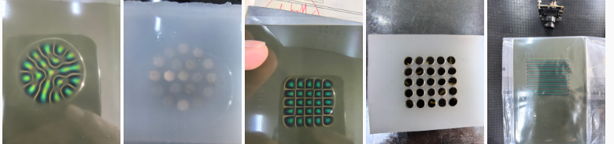
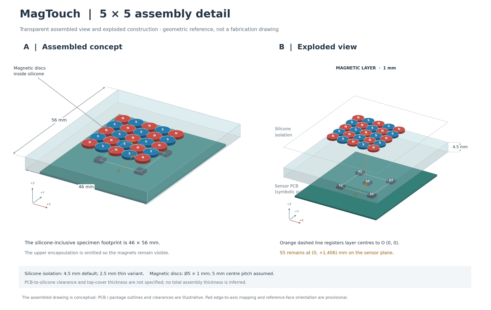

# Supplementary methods and provenance for five node magnetic contact reconstruction

## S1 Experimental identities and scientific names

CCA is the concentric alternating-polarity disc array, internally labelled 19C. CPA is the checkerboard alternating-polarity disc array, internally labelled 5x5. PSM-L and PSM-H are parallel-stripe magnetic sheets with nominal isolation layers of 2.5 and 4.5 mm, internally labelled flot1650-2.5mm and flot1650-4.5mm. They are three layouts and four configurations. The historical indenter label flat_d6mm denotes mounting-related metadata, not the contacting diameter. The confirmed contact-end diameter is 1 mm; the outer dimension is 4 mm and the mounting thread is M6 × 1.

SC-RBF denotes sparse-calibration continuous regression, DC-RBF dense-calibration continuous regression, WD-RBF working-domain regression, DPL discrete prototype localization, and WD-Causal a working-domain kernel decoder with causal history correction. Names alone do not identify a training set. The model file and the table below together define the evaluated instance.

| Evaluation | Training source | Test source | Interpretation |
|---|---|---|---|
| Four configurations | S20260917_A plans; 36 of 121 positions | Other 85 positions, 510 contacts per configuration | Spatial generalization |
| Frozen CPA SC-RBF and DC-RBF | S20260918_A Trials 149, 150, 153 | Trial 154; 441 contacts | Independent repeated contacts at known grid positions |
| DPL | Historical mixed pool; 2489 contacts | The same reserved Trial 154 | Discrete-node task, not a controlled training-density comparison |
| WD-RBF cross scan | Same-source deployment using 0.4 and 0.6 mm | S20260920_A Trial 005 | Later motion record |
| WD-Causal radial and circle | Earlier CPA static source plus nine earlier motion records | S20260920_A Trials 017, 018, 020 | New trajectory recordings |
| Dense deployment XYZ | Historical mixed pool, 2489 contacts | S20260920_A Trials 026, 028, 030, 031, 032, 034, 035 and 036 | Representative simultaneous XYZ motions |

Table S1. Dataset roles. Some later production models include Trial 154; they must not replace the frozen models when reproducing the independent static result.

The matched four-configuration source plans end in 202428 for CCA, 211757 for CPA, 143129 for PSM-L and 220949 for PSM-H on 17 September 2026. The frozen CCA comparison is not replaced by a later remounted CCA model. Exact plan names are preserved in the data files. Each configuration provides 121 positions × three depths × two repeats = 726 contacts. Spatial parameter selection and the 85-location evaluation are separate from the subsequent full-map deployment fit.

## S2 Model implementation details

The frozen static reproduction script rebuilds both continuous models from contact-level delta-B values and checks them against the saved coefficient arrays. The sparse training set contains 363 contacts and the dense set 1322 contacts. Both predict all 441 reserved contacts without a contact gate. Their exact planar mean errors are 0.349466985 and 0.288394377 mm. The dense per-axis MAEs are 0.163168897, 0.205812498 and 0.031477144 mm. DPL identifies 412 nodes correctly and has planar mean error 0.073112564 mm and Z MAE 0.010700187 mm.

For DPL, the score of a position is the maximum cosine similarity over its template bank, not the cosine similarity to a single averaged template. If A = kz + b is the local fitted amplitude relation, the decoded indentation is (A − b)/max(k, epsilon). DPL uses an additional historical source pool and is not used to attribute improvement solely to model type.

The frozen dense regression uses 441 unit-response centres, a 441 × 2 XY coefficient matrix and 33 depth coefficients including the last-column intercept. The sparse depth feature concatenates raw delta-B, log amplitude and squared log amplitude. Scales below 10 to the power −6 are replaced by one. The released offline predictor checks input shape and finiteness and reproduces the reference predictions.

The selected WD-Causal model uses a standardized Gaussian kernel of the form exp(−gamma × squared distance / bandwidth). XY parameters are gamma = 0.1, ridge penalty = 0.001 and bandwidth = 59.5226290521. Z parameters are gamma = 0.3, ridge penalty = 0.01 and bandwidth = 0.586188748. The Z output mean is 0.65 mm. Training coordinates, standardization and output means are retained with the model. The base XY feature is the 32-dimensional shape–log-amplitude interaction feature; the base Z feature is the 15-dimensional raw difference.

For the history gate, the instantaneous activation is clipped to the interval zero to one after computing the normalized short-lag magnetic-change magnitude divided by 0.0267405688 minus one. The current gate is the larger of this activation and the preceding gate multiplied by exp(−dt/1.2 s). A gap above 0.25 s resets history. The residual model has 136 standardized features and a first-column intercept, giving 137 × 3 coefficients. The intercept convention therefore differs from the frozen static depth model. Its nine dynamic training records are S20260918_A Plan_20260918_022707 Trials 078–085 and 090. None of the reported S20260920_A radial or circle records participates in this training.

## S3 Dynamic records and selection

The public dynamic export contains the 17 records used in the manuscript: Trials 004, 005, 017–020, 026, 028, 030–032 and 034–039. For each released record, the package preserves the parameters, mounting calibration, segment predictions, command-derived references and validity counts used in the reported calculations. The reproduction script recalculates the saved scalar metrics from these arrays; it is not a new inference run from the original magnetic streams.

The eight simultaneous-XYZ records in Table S2 are representative demonstrations selected from completed motions and reported individually. They were not prospectively defined as an exhaustive all-direction benchmark, so no success-rate or direction-invariant generalization claim is made. Development trials, interrupted acquisitions and experiments not used in the paper are retained by the authors as research records but are outside this publication package. The package therefore documents every record used for a paper result without purporting to release the entire development archive.

| Trial in S20260920_A | Condition | Planar error mm | Z MAE mm | Coverage |
|---|---|---:|---:|---:|
| 004 | SC-RBF cross, extent 6 mm | 0.855 | 0.0498 | 100% |
| 005 | WD-RBF cross, extent 6 mm | 0.510 | 0.0789 | 97.44% |
| 017 | WD-Causal eight directions, radius 4 mm | 0.453 | 0.0556 | 100% |
| 018 | WD-Causal circle, radius 2 mm, movement only | 0.407 | 0.0485 | 100% |
| 019 | WD-Causal circle, radius 4 mm, movement only | 1.129 | 0.1062 | 100% |
| 020 | WD-Causal circle, radius 4 mm, movement only | 0.772 | 0.0829 | 100% |
| 026 | XYZ increment (−4, +4, +1.2) mm | 0.613 | 0.1012 | 100% |
| 028 | XYZ increment (+4, −4, +1.2) mm | 0.715 | 0.0904 | 98.74% |
| 030 | XYZ increment (−8, +8, +1.4) mm | 0.679 | 0.1134 | 100% |
| 031 | XYZ increment (−8, −8, +1.2) mm | 0.773 | 0.0332 | 100% |
| 032 | XYZ increment (+8, −8, +1.2) mm | 0.561 | 0.0725 | 99.91% |
| 034 | XYZ increment (−10, +10, +1.2) mm | 0.781 | 0.1214 | 99.26% |
| 035 | XYZ increment (−10, −10, +1.0) mm | 0.753 | 0.1136 | 100% |
| 036 | XYZ increment (−6, +6, +1.0) mm | 0.570 | 0.1042 | 100% |
| 037 | Later constant-depth motion record | 0.771 | 0.1294 | 88.09% |
| 038 | Later constant-depth motion record | 0.770 | 0.0992 | 81.12% |
| 039 | Later static 81-position grid at 0.6 mm | 0.728 | 0.1063 | 100% |

Table S2. Record-level results, with static Trial 039 evaluated on final hold medians rather than motion frames. It is a later-session result and is not substituted for the reserved static result in the abstract.

Trial 032 contains 550 and 541 valid samples in its two executions. Their XYZ mean errors are 0.564253 and 0.573692 mm. Across the eight representative XYZ records (Trials 026, 028, 030, 031, 032, 034, 035 and 036), XYZ mean error ranges from 0.569 to 0.796 mm, output coverage ranges from 98.74% to 100%, and the median XYZ mean error is 0.710 mm. The saved mounting transform for Trials 026–039 is a planar rotation of −5.3205175 degrees and translation (1.5632454, 0.9619818) mm. The transform for Trials 015–025 is −10.4907044 degrees with translation (2.3352261, 0.7579724) mm. These are recorded pre-test calibration states, not transforms fitted to the test paths. Different model and calibration states mean that Trial 025 versus Trial 026 is not a clean paired algorithm ablation.

Circular movement is generated as 128 linear segments with host waiting. Full-contact errors, including waits, are 0.3904056 and 0.7518913 mm for WD-Causal radii of 2 and 4 mm. Average complete-path speeds are approximately 0.322351 and 0.555654 mm/s. No fitted-circle correction is used to compute these absolute errors. Coverage includes eligible samples in segments that contain no valid predictions.

## S4 Acquisition settings, repeated response and reassembly evidence

The 67 successfully decoded per-device register snapshots in this release record MLX90393 GAIN = 5, HALLCONF = 12, RES X/Y/Z = 0, DIG FILT = 0, OSR/OSR2 = 0 and temperature compensation disabled; the acquisition logs record a 400 kHz I2C clock. A further 23 device readback entries contain diagnostic status errors and are retained as such rather than interpreted as register values. The decoded snapshots supersede a legacy profile comment that mentioned gain 7. Across the 17 manuscript-used Session III records, the effective saved sample rate ranges from 37.82 to 38.59 Hz. The reserved static Trial 154 has an effective rate of 65.63 Hz.

Short unloaded windows are released with the acquisition summary. Across 111 Session III windows, the median within-window channel standard deviation is 6.62 microtesla and the 95th percentile is 12.23 microtesla; the median absolute shift between successive unloaded windows is 3.48 microtesla and its 95th percentile is 11.74 microtesla. Across the 441 unloaded windows in Trial 154, the corresponding median standard deviation is 6.66 microtesla and the median shift is 3.75 microtesla. These values characterize the recorded acquisition windows, not a universal sensor noise specification.

Trials 153 and 154 provide a matched same-coordinate response comparison across 440 contacts. Their median unit-response cosine similarity is 0.99942. The median response-amplitude change is +0.36%, and the 95th percentile absolute relative change is 2.80%. This is evidence of repeated magnetic-response consistency; it is not a positioning-error estimate.

The metadata audit covers 398 acquisition records and detects ten layer transitions. It confirms multiple physical assembly changes, including returns to the CPA configuration at Trial 148 and S20260919_A Trials 013, 054 and 113; Trials 054 and 113 are explicitly marked as five-point reassembly records. A common registration file used by Trials 026–039 describes their shared evaluation state and must not be interpreted as evidence that only one physical disassembly occurred in the study.

A controlled same-depth comparison between Trials 178 and 201 contains two repeats at 63 positions in each state. After reseating, the median response amplitude changes from 1023.9 to 326.7 microtesla, while release-completion counts change from 2/126 to 126/126. This identifies assembly state as an important experimental-domain variable. The comparison does not estimate a population distribution of remounting error. Depth-path records S20260919_A Trials 133 and 134 are also included to document the manuscript's separate depth-motion observations.

## S5 Physical documentation and videos

Figure S1. Supplied photographs, from left to right, show the CCA viewing-film pattern, CCA specimen, CPA viewing-film pattern, CPA arrangement and PSM viewing-film pattern. Viewing-film contrast is qualitative evidence of magnetic organization, not a calibrated field-magnitude map.

Figure S2. Existing assembled and exploded drawing of the checkerboard specimen. The gaps in the exploded view are illustrative. The drawing is a structural model, not a field simulation or a deformation solution.

Video S1 shows a replay of recorded cross-scan measurements from S20260919_A Trial 035, together with the side-view camera and recorded model trajectory. Video S2 shows a replay segment of S20260920_A Trial 036, with simultaneous XYZ motion, recorded camera images and reconstructed coordinates. These are recordings of the replay interface displaying real experimental data; they are not labelled as fresh live acquisition videos. Their filenames preserve the originally supplied clips. No new experimental frames are generated.

## S6 Reproducibility and remaining submission metadata

The repository separates static contact-level reproduction, dynamic recorded-output reproduction, acquisition evidence, reassembly evidence, model parameters, specimen documentation and the manuscript. The compact static export supports refitting the frozen continuous models. The dynamic export supports checking errors and coverage but does not include all raw 15-channel magnetic streams or every acquisition command needed to regenerate the entire acquisition pipeline. Original full records and development assets remain under the authors' control.

Author names, affiliations, funding and declarations remain placeholders by request. Silicone formulation, curing conditions and hardness must be confirmed from fabrication records before submission. Journal-specific upload requirements must be checked in the submission system.
